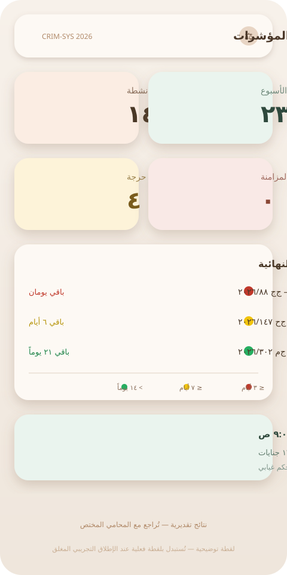
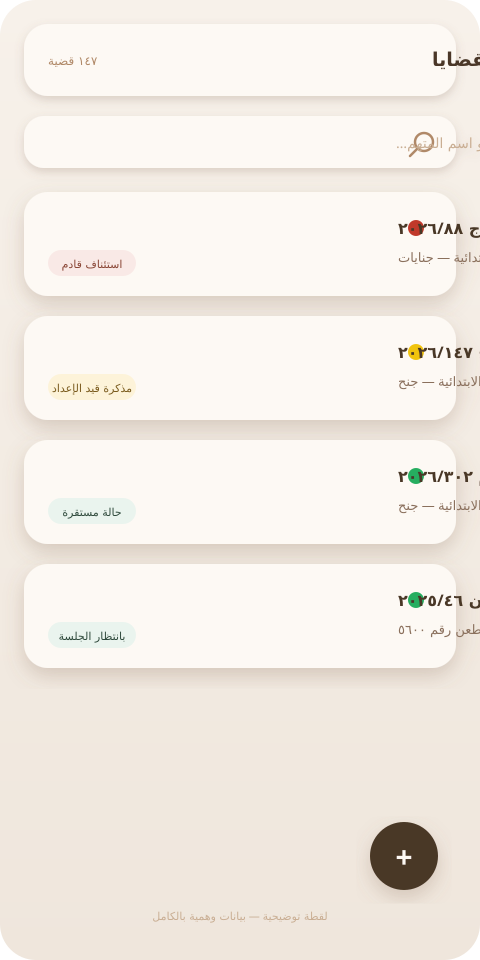
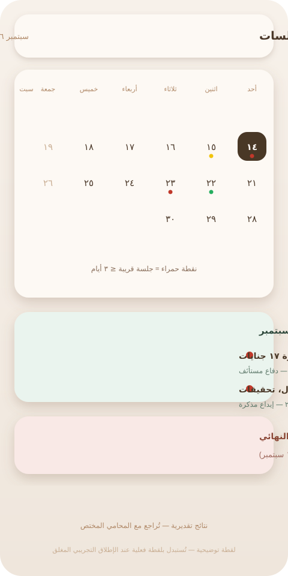
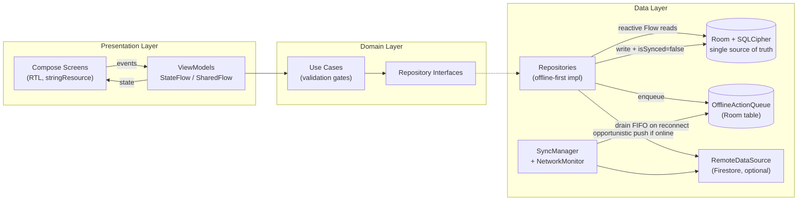

<p dir="rtl" align="center">

# ⚖️ CRIM-SYS 2026 — منظومة إدارة القضايا الجنائية

### LAW-SYS 2026 Master Edition

منظومة عمل رقمية للمكاتب القانونية المصرية — offline-first، مشفّرة محلياً، وعربية بالكامل.

</p>

<p align="center">
  <a href="https://github.com/AlySelim2001/legal-clay-app/actions/workflows/android-release.yml">
    
  </a>
  <a href="LICENSE">
    
  </a>
  <a href="https://kotlinlang.org">
    
  </a>
  <a href="https://developer.android.com/jetpack/compose">
    
  </a>
  <a href="https://developer.android.com/about/versions/15">
    
  </a>
  <a href="https://github.com/AlySelim2001/legal-clay-app/pulls">
    
  </a>
  <a href="DISCLAIMER.md">
    
  </a>
</p>

---

<p dir="rtl">

## 🇪🇬 نظرة عامة — لماذا هذا المشروع؟

**المشكلة:** ملف القضية الجنائية في المكتب المصري يعيش اليوم بين ورقٍ مبعثر، ومفكرات شخصية، ورسائل واتساب — بينما الموعد النهائي للطعن أو حضور الجلسة لا يحتمل خطأً واحداً. ضياع موعد واحد قد يضيّع قضية كاملة.

**الحل:** CRIM-SYS 2026 تطبيق أندرويد أصلي يعمل **دون اتصال بالإنترنت داخل قاعة المحكمة**، يخزّن كل شيء **مشفّراً على الجهاز** (SQLCipher)، ويحتفظ بأي إجراء أُضيف دون شبكة في **طابور مزامنة مؤجل** يُفرَّغ تلقائياً عند عودة الاتصال.

> **إخلاء مسؤولية:** هذه **أداة تنظيمية مساعدة** ولا تُغني بأي حال عن الاستشارة القانونية المتخصصة — راجع [DISCLAIMER.md](DISCLAIMER.md).

</p>

---

## ✨ الميزات الرئيسية / Key Features

### 📱 تطبيق أندرويد أصلي (الإصدار المرجعي للإنتاج)

| الميزة | الوصف |
|--------|-------|
| 🔐 **تشفير كامل محلياً** | قاعدة بيانات Room مشفّرة بـ SQLCipher؛ المفتاح 256-bit ملفوف بمفتاح Android Keystore (AES-GCM) |
| 📴 **Offline-First** | Room هو مصدر الحقيقة الوحيد؛ القراءات لا تلمس الشبكة أبداً |
| 🔄 **طابور المزامنة المؤجلة** | أي إجراء دون اتصال يُسجَّل ويُفرَّغ FIFO إلى Firestore عند عودة الشبكة، مع الحفاظ على الترتيب وعدّاد المحاولات |
| 📅 **تقويم الجلسات** | تقويم kizitonwose Compose مع مؤشرات أيام الجلسات |
| 📝 **محرر المذكرات** | محرر نصوص غني (richeditor-compose) يدعم العربية وRTL بالكامل |
| 🌐 **عربي أولاً** | واجهة RTL أصيلة عبر `stringResource` — عربي/إنجليزي بدون إعادة بناء |
| ⚡ **بدء سريع** | Baseline Profile يسرّع الإقلاع البارد حتى ~30% |
| 🛡️ **سياسة شبكة صارمة** | منع Cleartext، وربط TLS بالنطاقات المسموحة فقط (Network Security Config) |

### 🤖 وكيل الذكاء الاصطناعي المتعدد (مرجع الويب)

| الوكيل | التخصص | القوانين المرجعية |
|--------|--------|-------------------|
| **مستشار الإجراءات والجنايات** | جنائي | قانون الإجراءات الجنائية 150/1950، القانون 174/2025 |
| **مستشار المدني والتجاري** | مدني وتجاري | القانون المدني 131/1948، قانون الإجراءات المدنية 13/1968 |
| **مستشار الأحوال الشخصية** | أسرة | القانون 25/1920، القانون 1/2000 |
| **مستشار القضاء الإداري** | إداري | قانون مجلس الدولة 47/1972 |
| **مستشار العمل والتأمينات** | عمل | قانون العمل 12/2003، التأمينات 148/2019 |
| **وكيل كولومبو التفتيشي** | تدقيق جنائي | المواد 40، 41، 44، 137 إجراءات جنائية |

### 📊 إدارة القضايا (مرجع الويب + جوهر الأندرويد)

- **سجل القضايا** — بحث وفرز وتصنيف ذكي
- **ملف القضية التفصيلي** — هوية القضية، المذكرة، الجلسات، المرفقات
- **حاسبة المواعيد** — جنائي، مدني، إداري، أحوال شخصية، عمل
- **كتالوج الدفوع الجنائية** — دفوع مرفقة بأحكام محكمة النقض
- **تصدير PDF** — مذكرات وجلسات بالخط العربي (Amiri)

---

## 🖼️ لقطات الشاشة / Screenshots

<p align="center">
  
  
  
</p>

> 📷 *Placeholders — يُستبدل هذا القسم بلقطات فعلية عند الإطلاق التجريبي المغلق (انظر [docs/LAUNCH_STRATEGY.md](docs/LAUNCH_STRATEGY.md)).*

---

## 🏗️ المعمارية / Architecture (English)

Clean Architecture on Android. **Room is the single source of truth**; Firestore is a
best-effort remote mirror reached through a FIFO offline action queue.



**Key invariants:**

- **Reads never touch the network** — `CaseDao.observeCases()` flows straight into
  ViewModels via `stateIn`.
- **Writes land locally first** (`isSynced = false`), enqueue an offline action, then
  attempt an immediate push; on failure the queue preserves FIFO order and retries
  on reconnect (booted in `CrimSysApplication` via an app-scoped `SupervisorJob`).
- **The SQLCipher passphrase** is a random 256-bit key wrapped by an Android Keystore
  AES-GCM key; DB file and key blob are excluded from cloud backups.
- **Firestore is optional** — without `google-services.json` the remote layer degrades
  gracefully and the app runs fully offline.

📖 Full module map and data-flow details: [android/README.md](android/README.md)

---

## 🛠️ التقنيات المستخدمة / Tech Stack

| الطبقة | التقنيات |
|--------|----------|
| **Android Native** | Kotlin 2.1, Jetpack Compose (Material 3), Navigation Compose, Hilt DI, Coroutines + Flow |
| **Data (Android)** | Room 2.6 + KSP, SQLCipher (`sqlcipher-android`), DataStore Preferences, kotlinx.serialization |
| **Sync (Android)** | Firebase Firestore (BOM 33.7), `NetworkMonitor` callbackFlow, `SyncManager` FIFO drain |
| **UI Extras (Android)** | kizitonwose Calendar Compose, richeditor-compose, Baseline Profiles, R8 + resource shrinking |
| **Web (المرجع التجريبي)** | React 19, TypeScript, Vite 7, Tailwind CSS 4, shadcn/ui, TanStack Query (offline persistence) |
| **Web OCR/Calendar** | Tesseract.js (Arabic), FullCalendar (Arabic RTL) |
| **CI/CD** | GitHub Actions — Gradle debug build QC + tag-driven release APK |

---

## 🚀 البدء السريع / Getting Started

### تطبيق الويب (مرجع تجريبي) — Web reference app

```bash
git clone https://github.com/AlySelim2001/legal-clay-app.git
cd legal-clay-app
bun install
bun run dev          # خادم التطوير
bun tsc -b --noEmit  # فحص الأنواع
```

### تطبيق الأندرويد الأصلي — Native Android app

```bash
cd android
./gradlew assembleDebug        # → app/build/outputs/apk/debug/app-debug.apk
./gradlew copyReleaseApk       # → app/build/distribution/CRIM-SYS-<ver>-<sha>.apk (يتطلب keystore.properties)
```

**المتطلبات:** JDK 17 + Android SDK (platform 35). يستخدم Gradle wrapper تلقائياً 8.9.

> 📖 أدلة تفصيلية: [android/README.md](android/README.md) • [BUILD_GUIDE.md](BUILD_GUIDE.md) • [android/RELEASE_CHECKLIST.md](android/RELEASE_CHECKLIST.md)

---

## 📦 تحميل النسخة الجاهزة / Downloads

- **أحدث إصدار موقّع:** صفحة [Releases](https://github.com/AlySelim2001/legal-clay-app/releases) — التطبيق يتحقق من التحديثات تلقائياً عبر GitHub Releases API.
- **بناء CI اليومي (debug):** [Actions → CRIM-SYS 2026 — Android Build](https://github.com/AlySelim2001/legal-clay-app/actions) ← artifact `CRIM-SYS-2026-Debug-APK`.

---

## 🤝 الحوكمة / Governance

هذا المشروع يرحّب بالمساهمات وفق ضوابط واضحة — خصوصاً لأن أي خطأ في منطق المواعيد قد يؤثر على قضايا حقيقية:

| المستند | الغرض |
|---------|-------|
| [CONTRIBUTING.md](CONTRIBUTING.md) | كيفية الإبلاغ عن خطأ / طلب ميزة / تقديم PR (التزام Clean Architecture + `Result<T>`) |
| [.github/pull_request_template.md](.github/pull_request_template.md) | قائمة تحقق الـ PR (معمارياً + RTL + بوابة الحساسية القانونية) |
| [CODE_OF_CONDUCT.md](CODE_OF_CONDUCT.md) | بيئة محترمة للجميع |
| [SECURITY.md](SECURITY.md) | الإبلاغ الخاص عن الثغرات الأمنية |
| [.github/ISSUE_TEMPLATE/legal_compliance.yml](.github/ISSUE_TEMPLATE/legal_compliance.yml) | ⚠️ قالب حساس: أخطاء الحسابات القانونية والمواعيد |
| [DISCLAIMER.md](DISCLAIMER.md) | الحدود القانونية لاستخدام الأداة |

---

## 🔒 الأمان والخصوصية / Security & Privacy

- **تشفير على الجهاز** — SQLCipher بكلمة مرور عشوائية غير قابلة للاستخراج (Keystore-wrapped)
- **استبعاد النسخ السحابي** — قاعدة البيانات ومفتاحها مستثنيان من Android Backup (`backup_rules.xml`)
- **مصادقة ويب** — Supabase Auth مع سياسات RLS على كل الجداول (المرجع التجريبي)
- **شبكة مغلقة** — Cleartext محظور؛ TLS مقيّد بنطاقات Google/Firebase + GitHub API لفاحص التحديثات
- **CI بدون أسرار** — توقيع الإصدار من `keystore.properties` خارج المستودع؛ `google-services.json` مستثنى من Git

---

## 🗺️ خارطة الطريق / Roadmap

- [x] طبقة بيانات مشفّرة + مزامنة مؤجلة (Room + SQLCipher + SyncManager)
- [x] قائمة القضايا، ملف القضية، تقويم الجلسات، محرر المذكرات
- [x] تصلّب الإنتاج: R8، Baseline Profile، Network Security Config، قواعد ProGuard
- [ ] حاسبة المواعيد القانونية (الأندرويد) — التحقق المزدوج من كل حساب
- [ ] مسح المستندات OCR عربي على الجهاز (ML Kit)
- [ ] سجل العملاء + لوحة المؤشرات التنفيذية (الأندرويد)
- [ ] التحقق داخل التطبيق من التحديثات → الربط بـ GitHub Releases (الكود جاهز، بانتظار أول إصدار موقّع)

---

## ⚠️ إخلاء المسؤولية القانوني

<p dir="rtl">

> **⚠️ نتائج تقديرية — يجب التحقق منها مع المحامي المختص قبل اتخاذ أي إجراء.**
>
> هذا النظام **أداة مساعدة لإدارة المعلومات وتنظيم البيانات القانونية**، ولا يُغني بأي شكل من الأشكال عن الاستشارة القانونية المتخصصة. جميع حسابات المواعيد النهائية والنتائج والتصنيفات تقديرية. المطوّر غير مسؤول عن أي ضياع قضايا أو حقوق ناجم عن الاعتماد على الحسابات التلقائية أو انقطاع الشبكة أو أخطاء الاستخدام. **النص الكامل:** [DISCLAIMER.md](DISCLAIMER.md).

</p>

---

## 📞 التواصل والدعم الفني

<div dir="rtl">

| القناة | التفاصيل |
|--------|----------|
| 📱 **واتساب** | [01119886662](https://wa.me/201119886662?text=%D8%A7%D9%84%D8%B3%D9%84%D8%A7%D9%85%20%D8%B9%D9%84%D9%8A%D9%83%D9%85%D8%8C%20%D8%A3%D9%88%D8%AF%20%D8%A7%D9%84%D8%A7%D8%B3%D8%AA%D9%81%D8%B3%D8%A7%D8%B1%20%D8%A8%D8%B4%D8%A3%D9%86%20%D9%86%D8%B8%D8%A7%D9%85%20%D8%A5%D8%AF%D8%A7%D8%B1%D8%A9%20%D8%A7%D9%84%D9%82%D8%B6%D8%A7%D9%8A%D8%A7%20%D9%88%D8%A7%D9%84%D9%85%D9%86%D8%B8%D9%88%D9%85%D8%A9%20%D8%A7%D9%84%D9%82%D8%A7%D9%86%D9%88%D9%86%D9%8A%D8%A9%20CRIM-SYS%202026.) |
| 🔗 **GitHub** | [AlySelim2001/legal-clay-app](https://github.com/AlySelim2001/legal-clay-app) |
| 🐛 **الأخطاء** | [Issues](https://github.com/AlySelim2001/legal-clay-app/issues) |
| 🔐 **الثغرات الأمنية** | [SECURITY.md](SECURITY.md) (إبلاغ خاص — لا تنشرها علناً) |

</div>

---

## 📄 الترخيص

Licensed under **MIT** — see [LICENSE](LICENSE). The CRIM-SYS 2026 / LAW-SYS 2026
name and branding are reserved by the copyright holder (see the NOTICE section of
the license file).

---

<p align="center">

**✨ صُنع بشغف للمجتمع القانوني المصري ✨**

</p>
