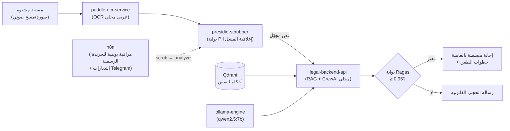

<p dir="rtl" align="center">

# 🛡️ CRIM-SYS 2026 — الدرع القانوني الرقمي للمواطن

### Legal Clay App — منظومة ذكاء اصطناعي محلية مفتوحة المصدر لتمكين المواطن وحمايته من جرائم الابتزاز المستندي وتزوير إيصالات الأمانة

</p>

<p align="center">
  <a href="https://github.com/AlySelim2001/legal-clay-app/actions/workflows/ci.yml">
    
  </a>
  <a href="https://github.com/AlySelim2001/legal-clay-app/actions/workflows/android-release.yml">
    
  </a>
  <a href="docs/ARCHITECTURE.md">
    
  </a>
  <a href="docs/ARCHITECTURE.md">
    
  </a>
  <a href="docs/ARCHITECTURE.md">
    
  </a>
  <a href="LICENSE">
    
  </a>
  <a href="DISCLAIMER.md">
    
  </a>
</p>

---

<p dir="rtl">

## 📌 الرؤية والهدف الاجتماعي

**المشكلة:** آلاف المواطنين في مصر يواجهون ظاهرة **التشكيلات العصابية المتخصصة في تزوير إيصالات الأمانة** وتوزيع **المحاضر الكيدية** عبر أقسام الشرطة على مستوى الجمهورية، بغرض الابتزاز والضغط المادي والمعنوي. المواطن العادي يجد نفسه أمام محرّر موقّع "بحقه" لا يعرف كيف يدحضه، وإجراءات قانونية لا يفهم لغتها، وموعد نائي لا يحتمل خطأً واحداً.

**الحل:** منظومة عمل رقمية مفتوحة المصدر تعمل **محلياً 100% دون أي خدمات خارجية مدفوعة**، تمنح المواطن والمحامي معاً:

1. **الفحص الجنائي الافتراضي للمحررات** — كشف مؤشرات التلاعب في إيصالات الأمانة والمحاضر.
2. **الدليل الإجرائي المدعوم بأحكام محكمة النقض** — خارطة طريق عملية لمواجهة القضايا الكيدية وإثبات التزوير والمطالبة بالتعويض.
3. **التبسيط بالعامية المصرية** — شرح الإجراءات والمسؤوليات بلغة يفهمها المواطن دون خلفية قانونية.
4. **إدارة كاملة للملف القضائي** — مواعيد، جلسات، مذكرات، ومزامنة مؤجلة تعمل داخل قاعة المحكمة بلا إنترنت.
5. **واجهة الوصول الشامل** — وضع استغاثة بثلاثة أزرار عملاقة (تصوير المستند، الشكوى الصوتية، خطوات الطعن)، وأوضاع ألوان لضعاف البصر وعمى الألوان، وتكبير خط حتى 200%، وقراءة صوتية بالعامية مع متابعة نصية متزامنة.

> **⚠️ إخلاء مسؤولية:** هذه **أداة تنظيمية ومساعدة فنية** ولا تُغني بأي حال عن الاستشارة القانونية المتخصصة أو محامٍ مقيد بنقابة المحامين — راجع [DISCLAIMER.md](DISCLAIMER.md).

</p>

---

<p dir="rtl">

## 💡 محاور الحماية القانونية

### 1. 🔍 الفحص الجنائي الافتراضي للمحررات (Document Authenticity)

- **الاستخراج النصي العربي:** معالجة صور الإيصالات والمحاضر عبر OCR عربي محلي (`PaddleOCR` بخدمة `paddle-ocr-service`) — بدون رفع أي صورة لخوادم خارجية.
- **كشف التلاعب (قيد التطوير 🚧):** طبقة رؤية حاسوب مخططة (`YOLO` + مقارنة SSIM عبر OpenCV) لرصد اختلاف أنماط الخطوط، والإضافات اللاحقة للتوقيع، وفحص سلامة الأختام — راجع [خارطة الطريق](#-خارطة-الطريق--roadmap).
- **ما هو متاح اليوم:** استخراج نص موثوق من المحرر، تحليله عبر محرك RAG القانوني، وتمييز البنية الشرعية/الشكلية الناقصة في إيصال الأمانة (ركن التسليم، توصيف المحرر، البيانات الإلزامية).

### 2. 🏛️ الدليل الإجرائي لمواجهة المحاضر الكيدية

محرك RAG محلي (`Qdrant` + تضمينات `BAAI/bge-m3`) مفهرس على نصوص قانونية وأحكام النقض المتصلة بـ:
- **الطعن بالتزوير** وإجراءاته أمام النيابة وأرباب الخبرة.
- **انتفاء ركن التسليم** في دعوى إيصال الأمانة، وصورية المحرر، والتوقيع على بياض.
- **خارطة طريق مواجهة عملية** بالعامية: طلبات الفحص والتجنيب، إجراءات التقرير بالطعن بالتزوير، دعاوى التزوير المباشر، والتعويض عن البلاغ الكاذب.

> يظل ناتج النظام **دليلاً معرفياً تنظيمياً** للتحضير مع المحامي — وليس رأياً قانونياً ملزماً.

### 3. 🗣️ التبسيط بلغة الشارع (العامية المصرية)

سلسلة وكلاء CrewAI فوق نموذج محلي (`qwen2.5:7b`، وبديل `jais-family-13b`) ينتهي بوكيل مخصص لتبسيط المفاهيم القانونية بالعامية، مع توضيح الفارق بين **المسؤولية الجنائية والمدنية**، وتحويل كل مخرَج إلى خطوات تنفيذية مرقمة. كل إجابة تمر على **بوابة دقة Ragas ≥ 0.95** — وأي إجابة أقل موثوقية تُستبدل برسالة حجب قانونية محددة سلفاً.

### 4. 🗂️ إدارة ملف القضية (للمحامي والمكاتب القانونية)

- سجل قضايا بحث وفرز، ملف قضية تفصيلي، تقويم جلسات، محرر مذكرات عربي RTL.
- **حاسبة المواعيد** القانونية المربوطة بالمنطقة الزمنية للقاهرة مع تخطي الجمعة/السبت (ومنظومة عطل رسمية قيد الاستكمال القانوني).
- **تطبيق أندرويد أصلي (الإصدار المرجعي للإنتاج):** offline-first مشفّر بالكامل (SQLCipher) مع طابور مزامنة مؤجل — مصمم لواقع قاعة المحكمة بلا شبكة.

</p>

---

<p dir="rtl">

## 🔒 البنية التحتية وحماية الخصوصية (Zero-Trust Security Stack)

بيانات الضحايا ومستنداتهم **لا تغادر جهازك أبداً**:

| الضمانة | التنفيذ |
|---------|---------|
| **تجهيل البيانات الشخصية (PII)** | بوابة `Microsoft Presidio` **إغلاقية الفشل**: كل نص يمر عليها قبل أي تحليل، مع مُعرِّف مخصص للرقم القومي المصري (14 خانة + تحقق Luhn + رموز المحافظات + الأرقام العربية-الهندية). نص محجوب أو خدمة متوقفة = رفض المعالجة، لا تجاوز للحماية |
| **عزل شبكي صارم** | شبكتان: `ai-internal` بلا أي اتصال بالإنترنت (`internal: true`)، و`edge` لخدمة n8n وحدها. لا منفذ يُنشر خارج `127.0.0.1` |
| **استدلال محلي 100%** | نماذج `Ollama` (`Qwen 2.5`) ومخزن متجهات `Qdrant` محمي بمفتاح API — لا اتصال بأي خادم خارجي |
| **أسرار مُدارة بشكل صحيح** | توليد تلقائي بـ `openssl rand -hex 32`، صلاحيات `600`، واستبعاد تام من Git |
| **بناء حتمي** | كل الصور المرفوعة من Docker Hub مثبتة بالإصدار — لا `:latest` |

📖 التفاصيل الكاملة: [docs/ARCHITECTURE.md](docs/ARCHITECTURE.md)

</p>

---

## 🏗️ المعمارية البرمجية (System Architecture)

```text
[مستند/إيصال أمانة مشبوه أو محضر كيدي]
        │
        ▼
[PaddleOCR عربي] ──► استخراج النص (التحقق البصري للتلاعب: قيد التطوير 🚧)
        │
        ▼
[Presidio PII Scrubber] ──► تجهيل الرقم القومي والأسماء (إغلاقي الفشل)
        │
        ▼
[Qdrant RAG + CrewAI / Qwen2.5 محلي] ──► مطابقة أحكام النقض + شرح الإجراءات
        │
        ▼
[بوابة Ragas ≥ 0.95] ──► إجابة موثوقة بالعامية المصرية، أو رسالة حجب قانونية
```



---

<p dir="rtl">

## 🗺️ خريطة المستودع

| المسار | المحتوى |
|--------|---------|
| [`local-ai/`](local-ai/) | **البنية المحصّنة** — 11 خدمة Docker على شبكتين معزولتين (التفاصيل: [local-ai/README.md](local-ai/README.md)) |
| [جذر المستودع](./) | تطبيق ويب مرجعي لإدارة القضايا (React + TypeScript + Vite) — واجهة المطور والتحقق التجريبي |
| [`android/`](android/) | تطبيق أندرويد أصلي للإنتاج (Kotlin + Compose + SQLCipher) — [دليل البناء](android/README.md) |
| [`docs/ARCHITECTURE.md`](docs/ARCHITECTURE.md) | توثيق معمارية Zero-Trust وبوابة PII |

</p>

---

## 🚀 التشغيل المباشر (Quick Start)

### 1. البيئة المحصّنة (Zero-Trust Local Stack)

<p dir="rtl">
إحدى عشرة خدمة مجانية ومفتوحة المصدر بالكامل، تعمل محلياً بعدة أوامر:

```bash
# 1. الانتقال لمجلد البيئة المحصنة
cd local-ai

# 2. توليد ملف الأسرار بمفاتيح حقيقية (32+ حرفاً تلقائياً) — لا يوجد قالب
#    .env.example عمداً؛ المولّد ينتج أسراراً فعلية بصلاحيات 600
make env           # ثم املأ TELEGRAM_BOT_TOKEN / TELEGRAM_CHANNEL_ID يدوياً

# 3. سحب النماذج المحلية (مرة واحدة)
make models        # qwen2.5:7b + bge-m3

# 4. إطلاق المنظومة بالكامل
make up            # docker compose up -d --build

# 5. فحص صحة كل الخدمات (إلزامي قبل الاستخدام)
make smoke
```

</p>

### ✅ قائمة التحقق الحاكمة قبل التشغيل (Pre-Flight — إلزامية)

<p dir="rtl">

- [ ] `.env` مولّد بـ `scripts/gen-env.sh` وصلاحياته `chmod 600` ومستثنى من Git
- [ ] خدمة الـ scrubber ترفض الإقلاع دون `INTERNAL_API_KEY` (≥ 32 حرفاً) — إغلاقية الفشل
- [ ] `docker compose ps` تُظهر كل المنافذ على `127.0.0.1` حصراً
- [ ] `ping -c1 8.8.8.8` من داخل `ai-internal` **يفشل** (عزل مؤكد)
- [ ] Qdrant يرد بـ 401 على أي طلب بلا ترويسة `API-KEY`
- [ ] `ollama list` يُظهر `qwen2.5:7b` و`bge-m3`
- [ ] مجلد `data/` نظيف قبل أول عملية استيعاب — لا يدخل المخزن المتجهي إلا نص مُجهَّل

</p>

### 2. تطبيق الويب المرجعي (Reference Web App)

```bash
git clone https://github.com/AlySelim2001/legal-clay-app.git
cd legal-clay-app
bun install
bun run dev          # خادم التطوير
bun tsc -b --noEmit  # فحص الأنواع
```

### 3. تطبيق الأندرويد الأصلي (Production Android App)

```bash
cd android
./gradlew assembleDebug        # → app/build/outputs/apk/debug/app-debug.apk
./gradlew copyReleaseApk       # → إصدار موقّع (يتطلب keystore.properties خارج المستودع)
```

<p dir="rtl">

**المتطلبات:** JDK 17 + Android SDK (platform 35). أدلة تفصيلية: [android/README.md](android/README.md) • [BUILD_GUIDE.md](BUILD_GUIDE.md) • [android/RELEASE_CHECKLIST.md](android/RELEASE_CHECKLIST.md)

</p>

---

## 🔒 الأمان والخصوصية / Security & Privacy

<p dir="rtl">

- **على الجهاز (الأندرويد):** SQLCipher بكلمة مرور عشوائية Keystore-wrapped، استبعاد النسخ السحابي، منع Cleartext، قفل بيومتري.
- **على الخادم المحلي (local-ai):** بوابة PII إغلاقية الفشل، شبكة داخلية بلا إنترنت، استدلال محلي بالكامل، أسرار مولّدة لا قوالب جاهزة.
- **في CI:** فحص Bandit الأمني + قواعد Ruff + تحقق بنيوي من الـ compose (منافذ loopback فقط، صور مثبتة، حرس الأسرار) — راجع [`.github/workflows/ci.yml`](.github/workflows/ci.yml).

</p>

---

## 🗺️ خارطة الطريق / Roadmap

<p dir="rtl">

- [x] بنية Zero-Trust محلية: RAG (Qdrant + bge-m3) + وكلاء CrewAI + بوابة Ragas 0.95
- [x] بوابة PII إغلاقية الفشل مع مُعرِّف الرقم القومي المصري (مختبَر 14/14 حالة)
- [x] طبقة بيانات أندرويد مشفّرة + مزامنة مؤجلة (Room + SQLCipher + SyncManager)
- [x] 🔍 **الطبقة الأولى من كشف التلاعب البصري** (SSIM عبر OpenCV): مقارنة بنيوية موضعية، فرق كثافة الحبر، ومؤشرات إضافات لاحقة — استرشادية فقط وبإشراف الخبير؛ كشف الأختام YOLO ما زال قيد التدريب 🚧
- [x] فهرسة مبادئ النقض المتخصصة (الجهالة / انتفاء ركن التسليم / البلاغ الكاذب) في مجموعة `egypt_cassation_rulings` مخصصة — المبادئ فقط، وأرقام الطعون بانتظار اعتماد مستشار قانوني
- [x] أتمتة الوكلاء بالفحص الجنائي: أداة SSIM داخل سلسلة CrewAI + أداة مبادئ النقض مع إظهار حالة مراجعة الاستشهاد
- [x] سير n8n لتنبيهات تطورات القضايا عبر قناة مغلقة مع إخلاء المسؤولية الإلزامي (`n8n/workflows/case-alerts.json`)
- [x] حاسبة المواعيد القانونية (الأندرويد) بالتحقق المزدوج عبر محركين مستقلين + تخطي الجمعة/السبت — القنوات الثلاث بانتظار اعتماد أرقام المواد
- [ ] مسح المستندات OCR عربي على الجهاز (ML Kit)
- [ ] تدريب نموذج YOLO خفيف على الأختام والتوقيعات المصرية (يُفعَّل تلقائياً عند تركيبه)

</p>

---

## ⚠️ إخلاء المسؤولية القانوني (Legal Disclaimer)

<p dir="rtl">

> **⚠️ نتائج تقديرية — يجب التحقق منها مع المحامي المختص قبل اتخاذ أي إجراء.**
>
> هذا المشروع **أداة تقنية مساعدة** قائمة على الذكاء الاصطناعي ومصادر القانون المصري المفتوحة، تهدف لمساعدة المواطنين على فهم حقوقهم ومواجهة التزوير وتنظيم ملفاتهم — **ولا يُعد بديلاً عن الاستشارة القانونية الرسمية** الصادرة من محامٍ مقيد بنقابة المحامين المصريين أو الجهات القضائية المختصة. جميع نتائج الفحص والتحليل والتصنيفات تقديرية، والمطوّر غير مسؤول عن أي قرارات أو إجراءات تُبنى عليها. **النص الكامل:** [DISCLAIMER.md](DISCLAIMER.md).

</p>

---

## 🤝 الحوكمة / Governance

| المستند | الغرض |
|---------|-------|
| [CONTRIBUTING.md](CONTRIBUTING.md) | كيفية الإبلاغ عن خطأ / طلب ميزة / تقديم PR |
| [.github/pull_request_template.md](.github/pull_request_template.md) | قائمة تحقق الـ PR (معمارياً + RTL + بوابة الحساسية القانونية) |
| [CODE_OF_CONDUCT.md](CODE_OF_CONDUCT.md) | بيئة محترمة للجميع |
| [SECURITY.md](SECURITY.md) | الإبلاغ الخاص عن الثغرات الأمنية |
| [.github/ISSUE_TEMPLATE/legal_compliance.yml](.github/ISSUE_TEMPLATE/legal_compliance.yml) | ⚠️ قالب حساس: أخطاء الحسابات القانونية والمواعيد |
| [docs/dependency-decisions.md](docs/dependency-decisions.md) | سجل قرارات الاعتماديات |
| [docs/LAUNCH_STRATEGY.md](docs/LAUNCH_STRATEGY.md) | استراتيجية الإطلاق والتوزيع |

---

## 📞 التواصل والدعم الفني

<div dir="rtl">

| القناة | التفاصيل |
|--------|----------|
| 📱 **واتساب** | [01119886662](https://wa.me/201119886662?text=%D8%A7%D9%84%D8%B3%D9%84%D8%A7%D9%85%20%D8%B9%D9%84%D9%8A%D9%83%D9%85%D8%8C%20%D8%A3%D9%88%D8%AF%20%D8%A7%D9%84%D8%A7%D8%B3%D8%AA%D9%81%D8%B3%D8%A7%D8%B1%20%D8%A8%D8%B4%D8%A3%D9%86%20%D9%86%D8%B8%D8%A7%D9%85%20%D8%A5%D8%AF%D8%A7%D8%B1%D8%A9%20%D8%A7%D9%84%D9%82%D8%B6%D8%A7%D9%8A%D8%A7%20%D9%88%D8%A7%D9%84%D9%85%D9%86%D8%B8%D9%88%D9%85%D8%A9%20%D8%A7%D9%84%D9%82%D8%A7%D9%86%D9%88%D9%86%D9%8A%D8%A9%20CRIM-SYS%202026.) |
| 🔗 **GitHub** | [AlySelim2001/legal-clay-app](https://github.com/AlySelim2001/legal-clay-app) |
| 🐛 **الأخطاء** | [Issues](https://github.com/AlySelim2001/legal-clay-app/issues) |
| 🔐 **الثغرات الأمنية** | [SECURITY.md](SECURITY.md) (إبلاغ خاص — لا تنشرها علناً) |

</div>

---

## 📄 الترخيص

Licensed under **MIT** — see [LICENSE](LICENSE). The CRIM-SYS 2026 / Legal Clay App
name and branding are reserved by the copyright holder (see the NOTICE section of
the license file).

---

<p align="center">

**✨ صُنع بشغف لحماية المواطن والمجتمع القانوني المصري ✨**

</p>
